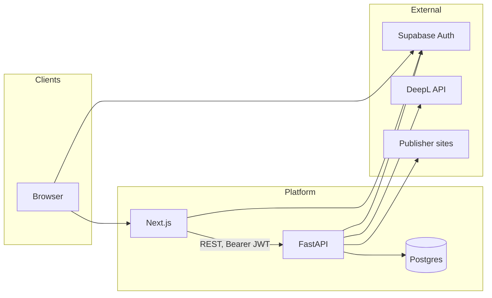
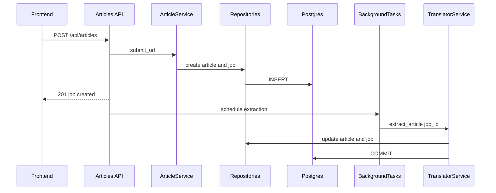
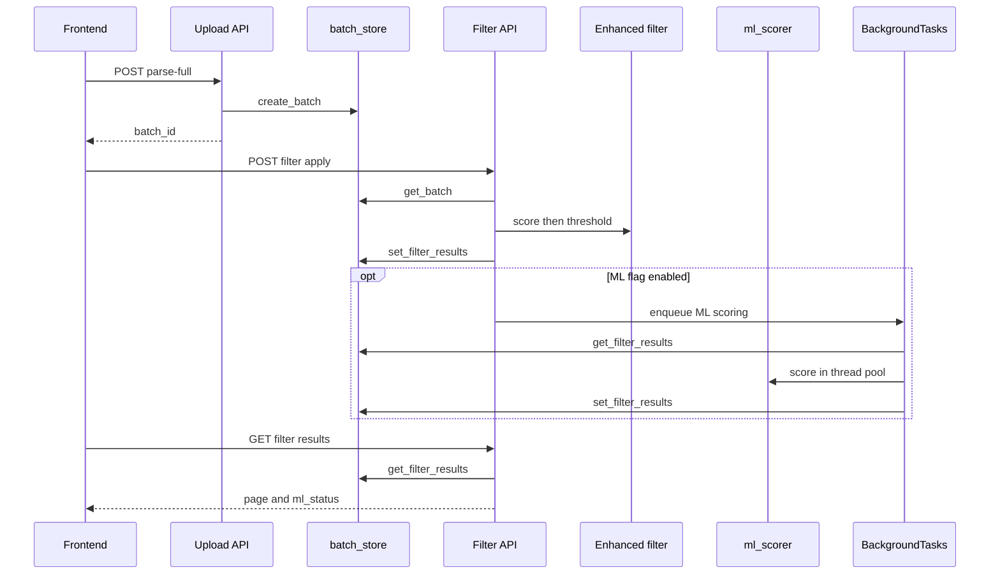
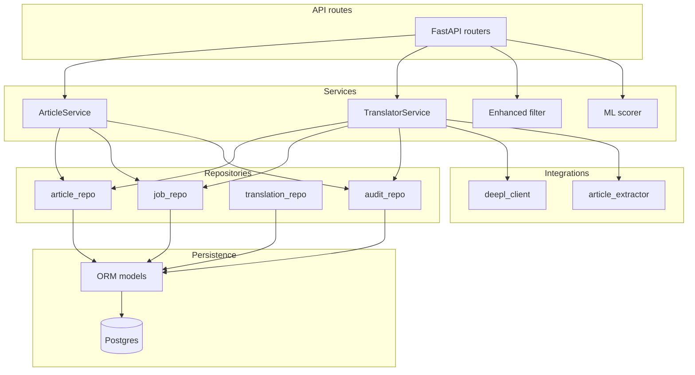

# Translation Platform

Internal human-in-the-loop platform for ingesting English news articles, scoring and filtering candidates, translating with DeepL, and publishing versioned translations after editorial review.

**Audience:** engineers onboarding to the codebase, operators, and reviewers who need a map of how services connect. For endpoint-level exploration, use the interactive API docs at `/docs` when the backend is running.

---

## Table of contents

1. [What this repo contains](#what-this-repo-contains)
2. [Quick start](#quick-start)
3. [Repository map](#repository-map)
4. [System architecture](#system-architecture)
5. [Data flows](#data-flows)
6. [Backend layering](#backend-layering)
7. [Domain model](#domain-model)
8. [Job lifecycle](#job-lifecycle)
9. [Filtering and optional ML scoring](#filtering-and-optional-ml-scoring)
10. [Frontend](#frontend)
11. [Security and configuration](#security-and-configuration)
12. [Operations](#operations)
13. [Further reading](#further-reading)

---

## What this repo contains

| Location | Role |
|----------|------|
| **`translation-platform/`** (this folder) | Production-oriented app: Next.js UI, FastAPI API, Postgres schema, Docker Compose. |
| **Parent repo** (`nordot eda`, outside this folder) | Research artifacts (notebooks, CSVs, offline model training). Those feed **optional** ML scoring only when a trained model is deployed under `backend/models/`. They are not required to run the core translation workflow. |

---

## Quick start

### Prerequisites

- Docker and Docker Compose
- DeepL API key (for translation)
- Supabase project (URL + anon key for the browser; JWT verification settings for the API)

### Run the stack

From this directory:

```bash
docker compose up
```

| Service | Default URL | Notes |
|---------|-------------|--------|
| Frontend | http://localhost:3000 | Next.js (`FRONTEND_PORT` overrides host port) |
| Backend API | http://localhost:8000 | FastAPI (`BACKEND_PORT` overrides host port) |
| OpenAPI | http://localhost:8000/docs | Interactive API documentation |
| PostgreSQL | localhost:5432 | Credentials default via Compose (see [`docker-compose.yml`](docker-compose.yml)) |

The backend container runs **`alembic upgrade head`** on startup, then **uvicorn** with `--reload`. Application code is bind-mounted from `./backend/app` for fast iteration; changing **`requirements.txt`**, the Dockerfile, or Alembic revisions requires an image rebuild.

### Environment variables

Configure via a **`.env`** file in this folder (loaded by Pydantic from the backend working directory) and/or host environment. [`docker-compose.yml`](docker-compose.yml) wires the main variables:

| Variable | Purpose |
|----------|---------|
| `DATABASE_URL` | Async SQLAlchemy URL (`postgresql+asyncpg://...`) |
| `DATABASE_URL_SYNC` | Alembic / sync drivers (`postgresql+psycopg2://...`) |
| `DEEPL_API_KEY` | DeepL translation |
| `DEEPL_FORMALITY`, `SOURCE_LANG`, `TARGET_LANG` | Translation defaults |
| `SUPABASE_URL` | JWKS URL base for ES256/RS256 JWT verification |
| `SUPABASE_JWT_SECRET` | Legacy HS256 verification when applicable |
| `NEXT_PUBLIC_SUPABASE_URL`, `NEXT_PUBLIC_SUPABASE_ANON_KEY` | Browser Supabase client |
| `NEXT_PUBLIC_API_URL` | Browser → API base URL (must be reachable from the user’s machine) |
| `STALE_JOB_TIMEOUT_MINUTES` | Jobs stuck in `IN_PROGRESS` longer than this are reset on API startup |
| `POSTGRES_USER`, `POSTGRES_PASSWORD`, `POSTGRES_DB` | Local Postgres (defaults in Compose) |
| `CORS_ORIGINS` | Comma-separated allowed origins (see [`backend/app/main.py`](backend/app/main.py); defaults to `*`) |

Never commit real secrets. Rotate any key that has appeared in chat or logs.

### Local development without Docker (optional)

- **Backend:** `cd backend && pip install -r requirements.txt && alembic upgrade head && uvicorn app.main:app --reload --host 0.0.0.0 --port 8000`
- **Frontend:** `cd frontend && npm install && npm run dev`

---

## Repository map

| Path | Contents |
|------|----------|
| [`frontend/`](frontend/) | Next.js App Router UI, shared types, Supabase auth client, API wrapper. |
| [`backend/app/api/`](backend/app/api/) | HTTP routers: articles, jobs, upload, filter, translations. |
| [`backend/app/services/`](backend/app/services/) | Business logic: submission, translation pipeline, rule-based filter, optional ML scorer. |
| [`backend/app/repositories/`](backend/app/repositories/) | Async SQLAlchemy data access. |
| [`backend/app/models/`](backend/app/models/) | ORM models (articles, jobs, final translations, audit, batches table). |
| [`backend/app/integrations/`](backend/app/integrations/) | DeepL client, article HTML extraction. |
| [`backend/app/auth.py`](backend/app/auth.py) | Supabase JWT verification (`get_current_user`). |
| [`backend/app/db.py`](backend/app/db.py) | Async engine, session factory, `get_db`. |
| [`backend/app/config.py`](backend/app/config.py) | Settings and supported language list. |
| [`backend/app/batch_store.py`](backend/app/batch_store.py) | In-memory store for upload/filter batches (TTL, concurrency lock). |
| [`backend/alembic/`](backend/alembic/) | Database migrations. |
| [`backend/models/`](backend/models/) | **Optional:** place `xgb_pooled.pkl` here for ML scoring (see [Filtering and optional ML scoring](#filtering-and-optional-ml-scoring)). |
| [`docker-compose.yml`](docker-compose.yml) | Postgres + backend + frontend services. |

---

## System architecture

High-level view of runtime components and external dependencies.



Arrows to Supabase: browser and Next.js use the Supabase client for login; FastAPI verifies JWTs against Supabase JWKS (or legacy secret).

**Background work:** FastAPI `BackgroundTasks` run extraction, translation, and optional ML scoring without blocking the HTTP response. Those tasks use their own DB sessions where appropriate.

---

## Data flows

### Flow A — Single URL submission

User submits one URL; the API creates rows and returns immediately; extraction runs in the background.



Subsequent steps (claim, translate, draft, publish) go through [`backend/app/api/routes_jobs.py`](backend/app/api/routes_jobs.py) with ownership checks tied to the authenticated user.

### Flow B — Bulk spreadsheet → filter → optional ML → batch submit

Editors upload a CSV/XLSX with full rows; the platform stores an ephemeral batch, scores articles, optionally enriches with ML predictions, then selected rows can be submitted as translation jobs.



**Important:** [`batch_store.py`](backend/app/batch_store.py) keeps batches **in process memory** with a **1-hour TTL** and a **maximum number of concurrent batches** (`MAX_BATCHES`). It is appropriate for a single API worker; **multiple replicas do not share state** without replacing this layer (e.g. Redis).

---

## Backend layering

Request path: **Route → Service → Repository → DB** (and **Integrations** for DeepL / HTTP fetch).



| Layer | Responsibility | Examples |
|-------|----------------|----------|
| **API** | HTTP, Pydantic request/response models, `Depends(get_current_user)`, `BackgroundTasks`, status codes | [`routes_articles.py`](backend/app/api/routes_articles.py), [`routes_jobs.py`](backend/app/api/routes_jobs.py), [`routes_filter.py`](backend/app/api/routes_filter.py) |
| **Services** | Orchestration, pipeline rules, invariants, non-trivial branching | [`ArticleService`](backend/app/services/article_service.py), [`TranslatorService`](backend/app/services/translator_service.py), [`enhanced_filter_service.py`](backend/app/services/enhanced_filter_service.py), [`ml_scorer.py`](backend/app/services/ml_scorer.py) |
| **Repositories** | Focused async CRUD and queries | [`job_repo.py`](backend/app/repositories/job_repo.py), [`article_repo.py`](backend/app/repositories/article_repo.py) |
| **Models** | Table shape and relationships | [`models/article.py`](backend/app/models/article.py), [`models/translation_job.py`](backend/app/models/translation_job.py) |
| **Integrations** | Third-party and IO-heavy clients | [`deepl_client.py`](backend/app/integrations/deepl_client.py), [`article_extractor.py`](backend/app/integrations/article_extractor.py) |

---

## Domain model

| Entity | Role |
|--------|------|
| **Article** | Canonical source: URL, extracted title/body, metadata. Unique by `source_url`. |
| **Translation job** | One workflow for translating that article to a target language: status machine, AI vs human draft fields, claim ownership, DeepL usage, errors. |
| **Final translation** | Immutable published snapshot per job; version increments on each publish. |
| **Audit log** | Append-only events for traceability (submissions, extraction, translation, failures). |
| **Batch (DB table)** | Schema exists for batches; **runtime filtering** uses the **in-memory** batch store keyed by UUID (see [`batch_store.py`](backend/app/batch_store.py)). |

Separation of **article** (source content) and **job** (process + outputs) keeps ingestion stable while allowing retries, claims, and version history without duplicating full article rows.

---

## Job lifecycle

Typical states (see [`JobStatus`](backend/app/models/translation_job.py) and services):

| State | Meaning |
|-------|---------|
| `PENDING` | Queued; extraction not finished (single-URL path). |
| `EXTRACTED` | Source text available; ready to claim (batch-created jobs may start here). |
| `CLAIMED` | Locked by a user for editing / translation trigger. |
| `IN_PROGRESS` | Extraction or DeepL translation running. |
| `READY_FOR_REVIEW` | AI translation done; human can edit and publish. |
| `PUBLISHED` | At least one `final_translations` row exists; further publish creates new versions. |
| `ERROR` | Terminal failure; retry paths reset toward `PENDING` where applicable. |

On API startup, [`main.py`](backend/app/main.py) runs **stale job recovery**: jobs in `IN_PROGRESS` longer than `STALE_JOB_TIMEOUT_MINUTES` are reset so a crashed worker does not strand work forever.

---

## Filtering and optional ML scoring

1. **Rule-based (always on for `/api/filter/apply`):** [`enhanced_filter_service.py`](backend/app/services/enhanced_filter_service.py) scores each row using freshness (publication date), title hook heuristics (regex tiers), a minimum word-count gate, and title penalty patterns. Results are sorted by `rule_based_score`; `apply_threshold` keeps rows above a configurable percentile among **eligible** articles.

2. **Optional ML (`use_ml: true` on filter apply):** A background task loads [`ml_scorer.py`](backend/app/services/ml_scorer.py), which expects a pickled XGBoost artifact at **`backend/models/xgb_pooled.pkl`** (path defined in code relative to the `backend` package root). It adds **`predicted_views`**, re-sorts by that field, and updates stored filter results. Status is exposed as **`ml_status`** (`idle` | `processing` | `ready` | `failed`) on filter responses.

**Dependencies:** `sentence-transformers` and `xgboost` are listed in [`backend/requirements.txt`](backend/requirements.txt). If the model file is absent, enabling ML will fail that background task (`ml_status: failed`).

**Legacy:** [`filter_service.py`](backend/app/services/filter_service.py) implements the older notebook-style scorer (length/freshness/visual/semantic). Production routes use the enhanced strategy via [`routes_filter.py`](backend/app/api/routes_filter.py).

---

## Frontend

| Route | Purpose |
|-------|---------|
| `/` | Dashboard and job list (`?view=mine\|unclaimed\|all`). |
| `/login`, `/signup` | Supabase authentication. |
| `/submit` | Single URL submission. |
| `/upload` | Spreadsheet upload and batch flows. |
| `/filter` | Candidate scoring, selection, batch submit to translation jobs. |
| `/jobs/[id]` | Side-by-side editor, claim / translate / publish. |

Key files:

- [`frontend/src/lib/api.ts`](frontend/src/lib/api.ts) — HTTP client; attaches Bearer token from auth.
- [`frontend/src/lib/auth-context.tsx`](frontend/src/lib/auth-context.tsx) — Session provider and `useRequireAuth`.
- [`frontend/src/lib/types.ts`](frontend/src/lib/types.ts) — TypeScript shapes aligned with API models.

---

## Security and configuration

- **Authentication:** Routes require a valid Supabase JWT. [`auth.py`](backend/app/auth.py) verifies RS256/ES256 via JWKS when `SUPABASE_URL` is set, with HS256 fallback when a legacy secret is configured.
- **Authorization:** Sensitive job actions enforce **claim ownership** in [`routes_jobs.py`](backend/app/api/routes_jobs.py) and in [`ArticleService`](backend/app/services/article_service.py) for draft/publish/retranslate-style operations.
- **CORS:** Controlled by `CORS_ORIGINS` in [`main.py`](backend/app/main.py); tighten for production.
- **Secrets:** Use environment variables or your host’s secret manager; do not embed keys in the frontend beyond the **Supabase anon key** (which is public by design).

---

## Operations

| Concern | Detail |
|---------|--------|
| **Health** | `GET /api/health` — returns `ok` if the database responds. |
| **Migrations** | Alembic revisions under [`backend/alembic/versions/`](backend/alembic/versions/). Ensure `DATABASE_URL_SYNC` targets the same logical database you intend to migrate. |
| **Logs** | Structured logging in services; watch for ML scorer and background task exceptions. |
| **Docker rebuild** | Required after `requirements.txt`, Dockerfiles, or non-mounted file changes. Frontend image does not mount source by default in Compose — rebuild the frontend service to pick up UI changes in containerized deploys. |
| **Horizontal scaling** | Replace or externalize [`batch_store.py`](backend/app/batch_store.py) before running multiple API replicas that must share upload/filter state. |

---

## Further reading

- [`PRODUCTION_READINESS_PLAN.md`](PRODUCTION_READINESS_PLAN.md) — deployment, tests, CI/CD, and production checklist.
- [`ENGINEERING_LESSONS.md`](ENGINEERING_LESSONS.md) — postmortems and design pitfalls specific to this project.
- [`../CLAUDE.md`](../CLAUDE.md) — optional AI assistant / tooling notes for the wider repository.

For **low-level API contracts**, run the backend and open **http://localhost:8000/docs**.
